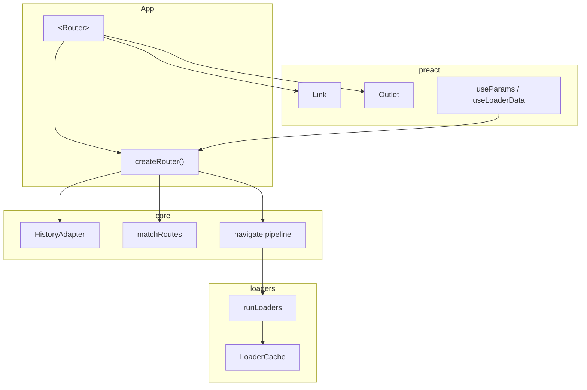

# @fixerframework/router — Declarative SPA router

> Preact-first, signals-native router with nested layouts and route loaders. Browser SPA v1; no file-based routing, no hard dependency on state/ui/auth.

## Decision summary

Build an **in-house declarative router** so dogfood apps (`apps/web`, blog, registry) do not depend on a third-party React-era router.

**v1 surface:** History API (browser + memory for tests), nested route trees, `Link` / `Outlet`, location/params as `@preact/signals-core` signals, per-route `loader` / `beforeLoad` with abort-on-navigate and parent reuse.



## Package boundaries

| Package | Responsibility |
| ------- | -------------- |
| `router` | URL matching, history, loaders, Preact bindings |
| `state` | Atoms/queries — **not** imported; loaders may call app-owned APIs |
| `ui` | Primitives — **not** imported (no cycle) |

**Dependency direction:** `apps` → `router`; `router` → `signals-core` + peer `preact` only.

## Public API (v1)

```ts
createRouter({ routes, history?, initialPath?, base? })
redirect(to, { replace? })
<Router router fallback? />
<Link href exact? replace? />
<Outlet />
useRouter / useLocation / useParams / useLoaderData / useNavigation
```

### Matching

- Nested `RouteDef` trees; child `path` joins onto parent
- `:param` and trailing `*splat`
- Ranking: static > param > splat; prefer longer patterns
- Trailing slashes stripped (except `/`)
- Optional `base` for subpath deploys

### Loaders

- Run root → leaf after match; commit location **after** success
- Reuse cached loader data when route id + params unchanged
- `AbortSignal` cancels in-flight work on superseding navigations
- `redirect()` throw/return; loop guard (max 10)
- Errors set `status: "error"` and `error` signal

### History

| Kind | Use |
| ---- | --- |
| `browser` | `pushState` / `replaceState` + `popstate` |
| `memory` | Tests and non-DOM |

## Non-goals (v1)

- File-based routes
- SSR/hydration reconciliation
- React compatibility
- Full typed path builders
- Coupling to `@fixerframework/state`

## File layout

```
packages/router/
  DESIGN.md
  index.ts
  src/core/     # types, path, match, history, create-router
  src/loaders/  # run-loaders, loader-cache
  src/preact/   # Router, Link, Outlet, hooks
  test/
```
