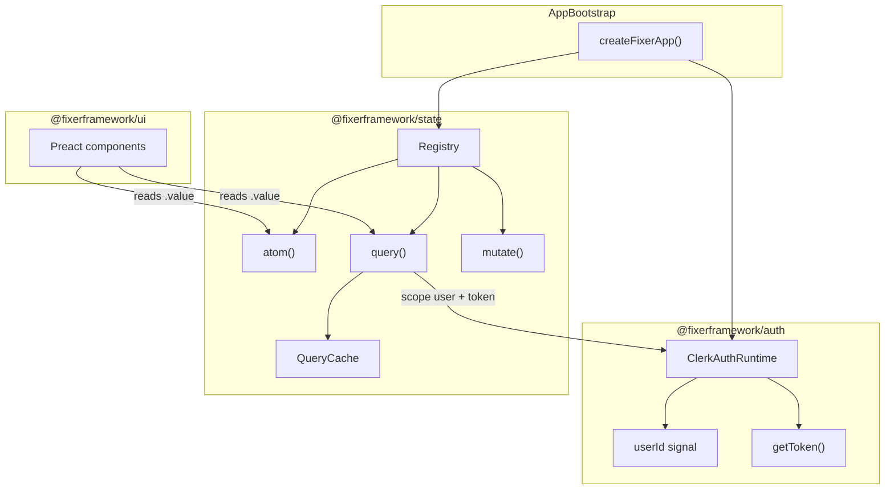

# @fixerframework/state — Unified Signal Store

> Signals-native unified store (atoms + queries + mutations) with Clerk-aware scoping. Browser SPA v1; minimal `@fixerframework/auth` runtime that state depends on.

## Decision summary

Build the **Unified Signal Store**: one model for client state (`atom`) and server state (`query`), both backed by `@preact/signals-core`, with Clerk auth as the root scope.

**v1 surface:** Browser SPA. Clerk JS loads client-side; queries run in the browser after auth is ready. SSR/hydration is explicitly deferred to v2 so v1 stays small and shippable.



## Package boundaries

| Package                    | Responsibility                                                                                             |
| -------------------------- | ---------------------------------------------------------------------------------------------------------- |
| [`packages/auth`](../auth) | Clerk client runtime: `userId`, `isLoaded`, `getToken()`, `onChange()` — **no knowledge of queries**       |
| [`packages/state`](.)      | Atoms, queries, cache, invalidation, mutations — **depends on auth runtime interface**                     |
| [`packages/ui`](../ui)     | Preact rendering; later adds `<Await>` / `<Show>` helpers that read query signals (optional stretch in v1) |

**Dependency direction:** `ui` → `state` → `auth`. No cycles.

## Public API (v1)

```ts
// packages/state/index.ts
export { createState } from "./src/create-state.ts";
export type { StateRuntime, Atom, Query, QueryStatus } from "./src/core/types.ts";

// Usage sketch
const state = createState({ auth });

const sidebar = state.atom({ open: false });
const projects = state.query({
  key: ["projects"],
  scope: "user",
  fetch: ({ token }) => api.get("/projects", { token }),
});
const count = state.derive(() => projects.data.value?.length ?? 0);

state.invalidate(["projects"]);
await state.mutate({
  key: ["tasks", id],
  optimistic: (t) => ({ ...t, done: true }),
  commit: ({ token }) => api.patch(`/tasks/${id}`, { done: true }, { token }),
});
```

### Primitives

- **`atom(initial)`** — writable `Signal<T>` registered globally by stable id (auto-generated or explicit `id` option)
- **`derive(fn)`** — computed signal; tracks dependencies automatically via signals-core
- **`query(def)`** — returns object of signals: `data`, `status`, `error`, `isFetching`, `isStale`
- **`mutate(def)`** — optimistic update on cache entry, rollback on error, invalidate/refetch on success
- **`invalidate(key)`** / **`invalidateScope('user')`** — cache busting
- **`configure({ fetch })`** — inject default fetch wrapper (auth adds Bearer token)

### Query cache semantics (v1 minimum)

- Stable serialized keys from tuple + plain objects
- In-flight deduplication per key
- `staleAfter` (default 60s, configurable globally)
- `enabled: () => boolean` for dependent queries
- `scope: 'user'` gates on `auth.isLoaded` + signed-in `userId`
- On auth identity change: `invalidateScope('user')` + `clearScope('user')` on sign-out

### Auth integration

Define a narrow interface in state, implemented by auth:

```ts
// packages/state/src/auth/types.ts
export interface AuthRuntime {
  readonly isLoaded: Signal<boolean>;
  readonly userId: Signal<string | null>;
  getToken(): Promise<string | null>;
  onChange(cb: (prev: string | null, next: string | null) => void): () => void;
}
```

[`packages/auth`](../auth) ships `createClerkAuth(config): AuthRuntime` wrapping `@clerk/clerk-js`.

`createState({ auth })` wires:

- default `fetch` that calls `auth.getToken()`
- `onChange` listener for scope invalidation

## File layout

```
packages/state/
  DESIGN.md             # this document
  index.ts
  src/
    core/
      types.ts          # Atom, Query, StateRuntime, AuthRuntime
      registry.ts       # global id → entry map
      serialize-key.ts  # JSON-stable key hashing
    primitives/
      atom.ts
      derive.ts
    query/
      cache.ts          # Map<key, QueryEntry>
      lifecycle.ts      # pending/success/error transitions
      query.ts          # query() factory
      mutate.ts         # mutate() factory
    auth/
      scope.ts          # scope gating + logout reset
    create-state.ts     # createState() bootstrap
  test/
    atom.test.ts
    query.test.ts
    cache.test.ts
    auth-scope.test.ts

packages/auth/
  index.ts
  src/
    clerk-auth.ts       # createClerkAuth()
    types.ts
```

## package.json changes

**`package.json`** (this package) — add:

```json
{
  "dependencies": {
    "@preact/signals-core": "catalog:preact",
    "@fixerframework/auth": "workspace:*"
  },
  "peerDependencies": {
    "preact": "catalog:preact",
    "typescript": "catalog:typescript"
  },
  "devDependencies": {
    "vitest": "catalog:",
    "@vitest/utils": "catalog:"
  },
  "scripts": {
    "test": "vitest run"
  }
}
```

**[`packages/auth/package.json`](../auth/package.json)** — add `@preact/signals-core` for auth signals (keeps auth UI-framework-agnostic).

**[`package.json`](../../package.json)** (root) — add `"test": "bun run --filter '@fixerframework/*' test"` (optional convenience).

## Implementation order

### Phase 1 — Core (no network)

1. `types.ts`, `registry.ts`, `serialize-key.ts`
2. `atom.ts`, `derive.ts`
3. Tests: atom read/write, derive invalidation

### Phase 2 — Query engine

1. `cache.ts` with `QueryEntry` holding signals for `data/status/error/isFetching`
2. `lifecycle.ts` — fetch orchestration, dedupe, stale marking
3. `query.ts` — public factory
4. Tests: dedupe, stale refetch, enabled gating, error recovery

### Phase 3 — Auth scope

1. Minimal `createClerkAuth()` in auth (load Clerk, expose signals)
2. `scope.ts` in state — user scope, token injection, logout reset
3. Tests: mock `AuthRuntime`; verify queries don't run until loaded; verify sign-out clears cache

### Phase 4 — Mutations

1. `mutate.ts` — optimistic snapshot, rollback, commit, invalidate
2. Tests: optimistic + rollback + success path

### Phase 5 — Bootstrap + docs in code

1. `create-state.ts` — single entry combining registry, cache, auth wiring
2. Export clean public surface from `index.ts`
3. Short usage example as comment block in `index.ts` (no separate README unless requested)

## Explicitly out of v1 scope

- SSR / hydration of auth or query cache
- `persisted()` atoms (localStorage)
- Tag-based invalidation beyond key prefixes
- Infinite queries / websockets
- Devtools panel
- `@fixerframework/ui` `<Await>` component (follow-up PR)

## v2 follow-ups

- Isomorphic `createState` with server prefetch + client hydrate
- `persisted()` atom helper
- UI helpers in [`packages/ui`](../ui) that consume query signals
- `createFixerApp()` top-level bootstrap combining auth + state + render

## Success criteria

- Atoms and derived signals update Preact components when `.value` is read in JSX
- Two components requesting the same query key share one fetch
- User-scoped queries auto-wait for Clerk, include token, and reset on sign-out
- `mutate()` performs optimistic update with rollback on failure
- All behavior covered by vitest unit tests (no browser e2e required for v1)

## Todos

- [x] **auth-runtime** — Add minimal ClerkAuthRuntime in packages/auth (signals for isLoaded/userId, getToken, onChange)
- [x] **state-core** — Implement registry, atom, derive, and key serialization in packages/state/src/core + primitives
- [x] **query-cache** — Build query cache, lifecycle, and query() factory with dedupe + staleAfter + enabled
- [x] **auth-scope** — Wire auth scope gating, token-injected fetch, and logout invalidation in packages/state/src/auth
- [x] **mutate** — Implement mutate() with optimistic updates, rollback, and cache invalidation
- [x] **bootstrap** — Add createState() bootstrap and clean public exports from packages/state/index.ts
- [x] **tests** — Add vitest tests for atoms, queries, cache dedupe, auth scope, and mutations
